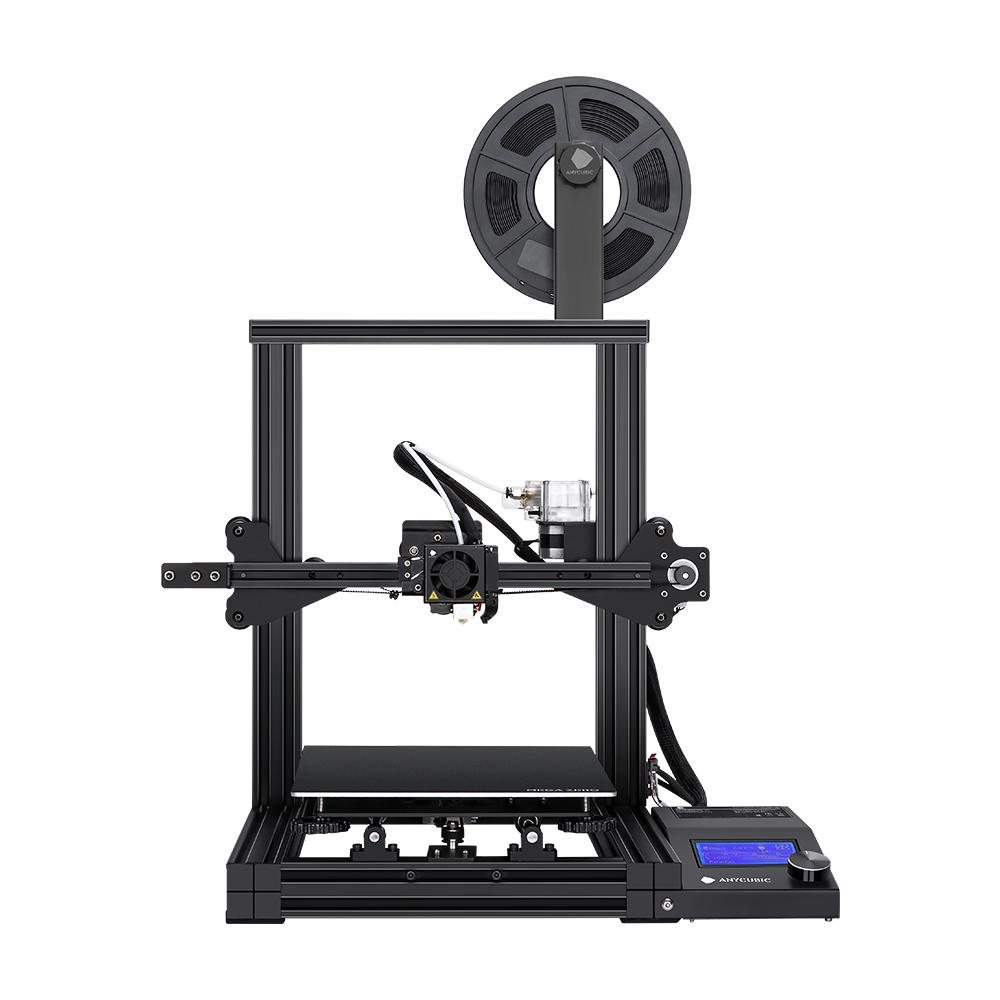
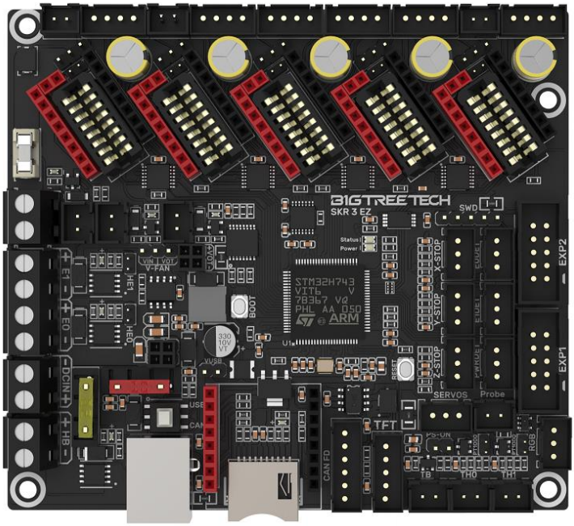

# Arneus diadematus

This file contains the documentation for 3d printer Arneus diadematus


## Asseble Frame
To asseble frame, follow the [Anycubic mega Zero](Frame/mega_zero.pdf) manual

## MCU
### BIGTREETECH SKR3 EZ

I have chosen this MCU for its array of features

### Connecting MCU
follow diagram given in the [manual](MCU/BIGTREETECH%20SKR%203%20EZ%20user%20manual.pdf)


## Configurations

### Klipper Configs
#### Calibrations
- Calibrate heaters
```sh
PID_CALIBRATE HEATER=extruder TARGET=200
```
```sh
PID_CALIBRATE HEATER=heater_bed TARGET=60
```

after each calibration runn:
```sh
SAVE_CONFIG
```

### MCU Config

### Mainsail Config


